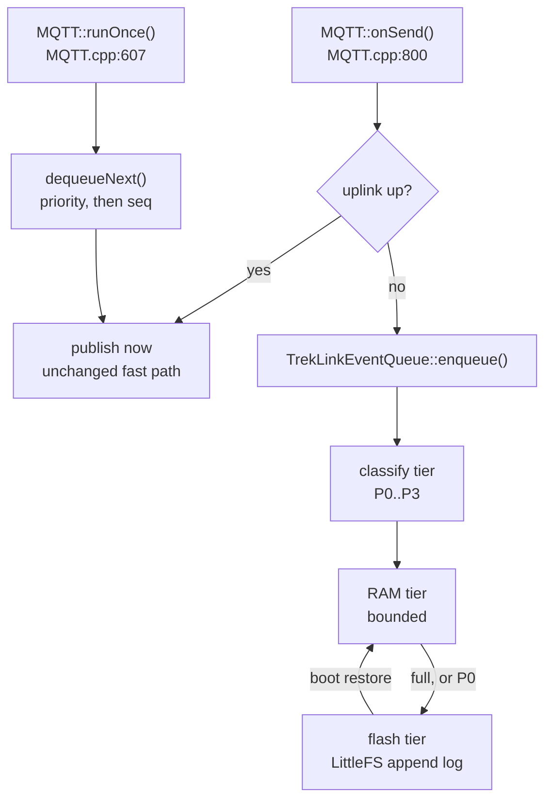
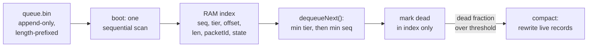
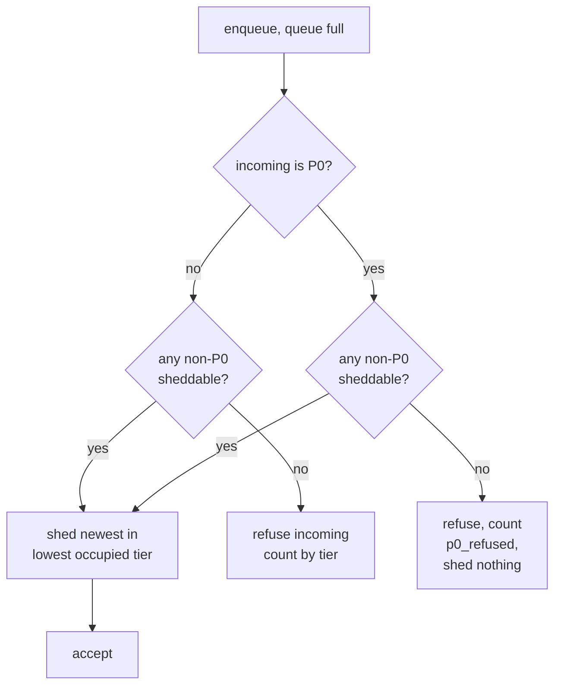

# Technical Design: onboard-queue (firmware)

> **Reads with**: [`requirements.md`](requirements.md) (EARS criteria this realises), `treklink-docs/_docs/00-project-context/04-firmware-ground-truth.md` §4.1–4.2 (the cited firmware facts), **D-018** / **D-019** / **D-021**.
>
> Every line number below was read in Session 7. Re-verify before editing — this is inherited upstream code and it moves.

---

## 0. Architecture Overview

The design is deliberately small: **one new component, two call-site branches, zero wire changes.**



***Figure 1*** — The queue sits only on the not-connected branch. The connected fast path at `MQTT.cpp:800` is untouched, so a node with a live uplink behaves exactly as it does today.

**The seam.** Stock code has precisely two places that touch `mqttQueue`, and they are the only two places this design modifies:

| Site | Stock behaviour | Change |
|---|---|---|
| `MQTT.cpp:818–831` | `if (numFree()==0) discard oldest;` then FIFO enqueue | delegate to `TrekLinkEventQueue::enqueue(p, topic, bytes, n)` |
| `MQTT.cpp:699–709` | `dequeuePtr(0)` — FIFO head | delegate to `TrekLinkEventQueue::dequeueNext()` |

Both are wrapped per **D-019 §1**: the stock body is extracted verbatim into `enqueueStock()` / `dequeueStock()` and selected by `#if !TREKLINK_ONBOARD_QUEUE`. The stock path stays compilable, readable, and flashable — which is what makes the RQ1 baseline reproducible rather than a git archaeology exercise.

```c
// MQTT.cpp — the shape of both call sites after the change
#if TREKLINK_ONBOARD_QUEUE
    trekLinkQueue->enqueue(p, topic, bytes, numBytes);
#else
    enqueueStock(topic, bytes, numBytes);   // verbatim stock body, preserved per D-019 §1
#endif
```

---

## 1. Record Format & Flash Layout

### 1.1 What is stored

An entry is the **existing** `QueueEntry` content plus metadata. `envBytes` is stored byte-for-byte as the stock code already encoded it — the design never re-encodes, which is what makes **REQ-UBI-03** structurally true rather than something to test for.

| Field | Type | Why |
|---|---|---|
| `seq` | `uint32` | monotonic enqueue order; the tiebreak within a tier (REQ-EVT-09) |
| `tier` | `uint8` | P0–P3 (REQ-EVT-03) |
| `packetId` | `uint32` | `MeshPacket.id`, so the backend can key `sha256(nodeNum:packetId)` — the reason on-device dedup is unnecessary (REQ-ERR-04) |
| `episodeActive` | `uint8` | set if enqueued during an SOS episode; drives the shed exemption (REQ-STA-04) |
| `topicLen` / `bodyLen` | `uint16` | length-prefixed, variable |
| `topic` | bytes | as built at `MQTT.cpp:794` |
| `envBytes` | bytes | the encoded `ServiceEnvelope`, **untouched** |
| `crc32` | `uint32` | detects the truncated tail of REQ-ERR-03 |

**Variable length, not fixed.** `MessageStore` uses fixed-size records (`MessageStore.cpp:244`) because it random-accesses a chat history. This queue does not: the RAM index holds offsets, so nothing needs uniform stride. The sizes genuinely differ — the encode buffer is declared `uint8_t bytes[meshtastic_MqttClientProxyMessage_size + 30]` = **531 bytes** (`MQTT.cpp:51`, `mesh.pb.h:2170`), while TrekLink's real payloads are far smaller: telemetry ~20 B, a position ~40 B, an SOS text capped by a 100-byte `snprintf` buffer. Fixed-size slots at worst case would waste roughly 4–5× the flash for no benefit.

### 1.2 Layout — one append log, index in RAM

**This resolves `requirements.md` Q3.**



***Figure 2*** — On-disk is a dumb log; all ordering intelligence is in the RAM index, rebuilt by the same single sequential scan `MessageStore::loadFromFlash()` already performs (`MessageStore.cpp:287` and its reader at `:265`).

- **Append-only writes.** A publish marks the record dead **in the index only** — no in-place flash write, which is where wear would otherwise come from.
- **Compaction** rewrites only live records, triggered when the dead fraction crosses a configured threshold, and opportunistically at boot. This is what holds the ≤1-erase-per-minute NFR.
- **Index cost**: 16 bytes/entry. 200 entries ≈ 3.2 KB (v3's bound), 1000 ≈ 16 KB (v2/v4). Acceptable against v3's ~320 KB DRAM, and v2/v4 have PSRAM besides.
- **Substrate** is `FSCom` (LittleFS on ESP32 — `FSCommon.h:28`) through `SafeFile`, the same pair `MessageStore` uses. `SafeFile` gives write-then-rename atomicity, which is what makes a compaction crash survivable.

> **Deliberate simplification with a named ceiling**: the index is a flat array scanned linearly for `dequeueNext()`. At the bounds above that is ≤1000 comparisons on a flush tick that already costs a TCP publish — irrelevant. If the bound ever grows past ~10 k, this wants four per-tier ring buffers instead. Recorded so the ceiling is a choice, not a surprise.

---

## 2. Component — `TrekLinkEventQueue`

New files, so the diff against upstream stays legible: `src/mqtt/TrekLinkEventQueue.h`, `src/mqtt/TrekLinkEventQueue.cpp`.

```c
class TrekLinkEventQueue {
  public:
    bool enqueue(const meshtastic_MeshPacket *p, const std::string &topic,
                 const uint8_t *env, size_t envLen);   // REQ-EVT-02, 03, 05, 06
    QueueEntry *dequeueNext();                          // REQ-EVT-09 ordering
    void commit(uint32_t seq);                          // publish succeeded -> mark dead (REQ-EVT-10)
    void restoreFromFlash();                            // REQ-EVT-08, tolerant per REQ-ERR-03
    void persistAll();                                  // REQ-EVT-07, shutdown hook
    const QueueStats &stats() const;                    // REQ-UBI-06, feeds REQ-EVT-12
  private:
    PriorityTier classify(const meshtastic_MeshPacket *p) const;  // REQ-EVT-03/04
    bool shed();                                                   // REQ-STA-02, REQ-ERR-01
    void compact();
};
```

`dequeueNext()` returns without deleting; `commit(seq)` is called only after the `/2/e/` publish succeeds. That ordering is what makes REQ-ERR-04's crash window a re-publish rather than a loss.

### 2.1 Classification (REQ-EVT-03, REQ-EVT-04)

```c
PriorityTier classify(const meshtastic_MeshPacket *p) {
    if (p->which_payload_variant != meshtastic_MeshPacket_decoded_tag)
        return P3;                                    // can't inspect; lowest tier
    switch (p->decoded.portnum) {
    case meshtastic_PortNum_TEXT_MESSAGE_APP:
        return (p->priority == meshtastic_MeshPacket_Priority_MAX) ? P0 : P3;
    case meshtastic_PortNum_POSITION_APP:
        return trekLinkSOSHelper->isEpisodeActive() ? P1 : P2;
    case meshtastic_PortNum_TELEMETRY_APP:
        return P3;
    default:
        return P3;
    }
}
```

**Why this is the strongest part of the design.** The backend cannot classify P1 reliably: the JSON MQTT envelope omits `MeshPacket.priority` entirely (`MeshPacketSerializer.cpp:410–424`, D-007), so `gateway-sync` has to infer an episode from beacon cadence and a backward grace window. The **device knows**. `TrekLinkSOSHelper` holds live episode state, and reading it is exact. On-device classification converts a heuristic into ground truth — and it costs one method call.

`isEpisodeActive()` does not exist yet; it is a const accessor over the beacon state `tickBeacon()` already maintains (`TrekLinkSOSHelper.cpp:181`). Additive, per D-019.

### 2.2 Shedding (REQ-STA-02, REQ-STA-04, REQ-ERR-01)



***Figure 3*** — Newest-first within the lowest occupied tier, inverting the stock drop-oldest policy that discards the SOS. An entry with `episodeActive` set is never sheddable while that episode is open.

Two properties worth stating plainly, because they are the inverse of stock behaviour:

1. **Newest-first within a tier**, not oldest-first. During a long outage the *oldest* telemetry is the only evidence of what the device was doing when the link dropped; the newest is the most redundant. Stock discards exactly backwards.
2. **A queued P0 is never shed to admit a newer P0** (REQ-ERR-01). Trading a known-buffered SOS for a fresher one is not an improvement, so the enqueue is refused and counted instead.

### 2.3 Flush ordering (REQ-EVT-09, REQ-STA-03)

`ORDER BY tier ASC, seq ASC` — all P0 before any P1, oldest first within a tier. One entry per MQTT thread tick, preserving the stock 200 ms cadence (`MQTT.cpp:609`, `:619`). A 1000-entry queue therefore drains in ~200 s; that is intentional. Dumping it at line rate would trip broker rate limits and starve the LoRa thread, and the NFR being measured is delivery rate, not drain speed.

### 2.4 Health reporting (REQ-EVT-12)

Depth-per-tier plus the REQ-UBI-06 counters are published as a packet on **`PRIVATE_APP` (256)** — the reserved application-specific range, currently unused by TrekLink (`04-firmware-ground-truth.md` §6).

This is the one place the design adds new information to the wire, and it is additive by construction: same `ServiceEnvelope`, same `<root>/2/e/<channelId>/<nodeId>` topic, new PortNum. Stock Meshtastic clients ignore an unrecognised PortNum, so **D-019 §3** holds and **REQ-UBI-04** is unaffected. It also establishes the `PRIVATE_APP` pattern that D-008's proposed custom SOS PortNum would later reuse.

Without this, the shed counters live only in a serial `LOG_WARN` and RQ1 has no device-side denominator — the queue would work and be unable to prove it.

---

## 3. Sequence — outage and recovery

```mermaid
sequenceDiagram
    participant S as SOS Helper
    participant M as MQTT onSend
    participant Q as TrekLinkEventQueue
    participant F as LittleFS
    participant B as Broker
    S->>M: SOS text, priority MAX
    M->>Q: enqueue (uplink down)
    Q->>Q: classify P0
    Q->>F: fsync immediately (REQ-EVT-06)
    S->>M: position beacon
    M->>Q: enqueue
    Q->>Q: classify P1 (episode active)
    Note over Q: telemetry fills RAM tier;<br/>sheds newest P3, never P0
    M->>Q: uplink restored, dequeueNext
    Q-->>M: P0 entry first
    M->>B: publish /2/e/
    B-->>M: ack
    M->>Q: commit(seq) -> mark dead
```

***Figure 4*** — The P0 fsync on enqueue and the publish-then-commit ordering are the two properties that make loss survivable at either end of the path.

---

## 4. Per-Variant Bounds (REQ-ERR-06)

All four are `build_flags` overrides per **REQ-UBI-05** / **D-015**, defaulted per variant in `variants/*/platformio.ini`:

| Variant | SoC | PSRAM | Flash | RAM tier | Flash tier |
|---|---|---|---|---|---|
| `treklink-v2_0` | ESP32-S3 N8R8 | 8 MB | 8 MB | 64 | 1000 |
| `treklink-v3-tbeam` | ESP32 LX6 | **none** | ~4 MB | 32 | **200** |
| `treklink-v4-supreme` | ESP32-S3 | 8 MB | 8–16 MB | 64 | 1000 |
| `treklink-v1_0` | ESP32 | none | 4 MB | — | **queue compiled out** (REQ-ERR-05) |

> ⚠️ **Never size the bound from PSRAM.** `StoreForwardModule` derives its capacity from `memGet.getFreePsram()` and falls back to `calloc` when PSRAM is absent (`StoreForwardModule.cpp:76–85`). Copying that idiom here would give v3 a near-zero queue while every test passed on v2. The bound is derived from **remaining LittleFS space**, clamped at init with a logged warning if the configured value does not fit.
>
> **Unverified and must be checked before Phase 1 closes**: the actual LittleFS partition size on each variant's partition table. 200 records × ~150 B average ≈ 30 KB and 1000 ≈ 150 KB, which should fit comfortably — but "should" is not a measurement, and v3's 4 MB is shared with two OTA app slots.

---

## 5. D-019 Compliance

| Constraint | How this design satisfies it | Verified by |
|---|---|---|
| §1 preserve stock logic | stock bodies extracted to `enqueueStock()` / `dequeueStock()`, selected by `#if`; queue lives in new files | AC-08 build comparison |
| §2 mobile app keeps working | the `proxy_to_client_enabled` branch at `MQTT.cpp:800` and `:607` is on the *connected* path and is not touched; BLE pairing is untouched | AC-09 |
| §3 stock MQTT endpoint | `envBytes` stored and republished byte-for-byte; topics rebuilt from the same `cryptTopic`/`jsonTopic` constants; only `PRIVATE_APP` health packets are new, and additively | AC-10 |

---

## 6. Testing & Measurement Strategy

**Unit** (`test/` native, no hardware): `classify()` across every PortNum × priority × episode-state combination; `dequeueNext()` ordering over a randomised mixed-tier queue; the shed decision tree of Figure 3 including the all-P0 refusal; record encode/decode round-trip; truncated-tail recovery.

**Integration** (on-device): boot restore with a pre-seeded `queue.bin`; power cut 50 ms after a P0 enqueue; compaction under a publish/enqueue mix; the AC-13 run repeated on v3.

**Comparative** (RQ1/RQ2) — the measurement that carries the research claim:

- **Baseline**: the stock build of **REQ-UBI-02**, which is the same binary as the current `dev` commit. This is precisely why D-019 §1 requires preserving it.
- **Method**: **cut the uplink only** — disable the node's Wi-Fi association while leaving the LoRa mesh up. Isolates the variable, reproducible in a room, no RF chamber.
- **Outage durations**: 30 s, 5 min, 30 min (RQ2's independent variable).
- **Recorded per run**: events generated, delivered, duplicated, shed by tier, ordering compliance, sync latency after reconnect.
- **The headline figure is AC-01**: an SOS behind 16 telemetry events. Stock evicts it. This design does not. That single before/after is the most defensible claim in the project, and it exists because the defect was found in inherited code rather than constructed.

---

## 7. Explicitly Not Built Here

- Buffering for **peer** nodes — Stage C (D-018/D-020). This queue holds only this node's own events, and that limit must never be overclaimed.
- On-device deduplication — the backend's unique index on `eventId` already provides it (REQ-ERR-04).
- Any change to `mqtt.encryption_enabled`, which stays `false` (D-007/D-021).
- The custom **PSK provisioning** step — belongs to `treklink-web/specs/devices/` per D-021, not here.
- The SOS-discriminator retransmit and beacon-priority fixes — specified as REQ-OPT-01/02 and sequenced **after** the queue in `tasks.md`, so each change's measured effect stays attributable to one change.
