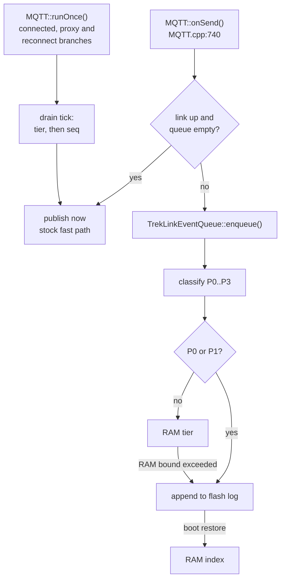
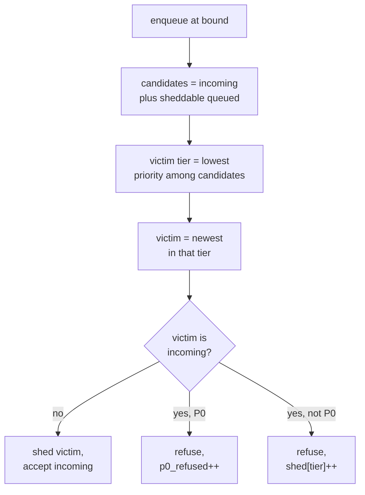

# Technical Design: onboard-queue (firmware)

> **Reads with**: [`requirements.md`](requirements.md) (the EARS criteria this realises), `treklink-docs/_docs/00-project-context/04-firmware-ground-truth.md` §2 and §4 to §5 (the cited firmware facts, re-audited 2026-09-25), **D-018**, **D-019**, **D-021**.
>
> Line numbers were re-read at `dev@733dd40`. This is inherited upstream code and it moves; re-verify before editing.

---

## 0. Architecture Overview

One pure policy core, one thin firmware adapter, three stock call-site branches, zero changes to what stock PortNums look like on the wire.



***Figure 1***: The queue sits on the not-connected branch, and on the connected branch only while a backlog exists (REQ-EVT-02). With an empty queue and a live link the stock fast path at `MQTT.cpp:800` runs unchanged.

### 0.1 Two layers

| Layer | Files | Depends on | Tested by |
|---|---|---|---|
| **Policy core** | `src/mqtt/TrekLinkQueueCore.{h,cpp}`, `src/mqtt/TrekLinkQueueConfig.h` | the C++ standard library only | `test/test_onboard_queue/`, under PlatformIO `native` and under host `g++` |
| **Firmware adapter** | `src/mqtt/TrekLinkEventQueue.{h,cpp}` | the core, `FSCom`, `SafeFile`, `MeshPacket`, the SOS modules, `notifyReboot`, `notifyDeepSleep` | on-device, Phase 7 |

The core owns every rule that carries an NFR: classification, ordering, shedding, exemption, spill, durability bookkeeping, record encoding, restore, compaction and the health payload. It reaches flash only through the `LogStorage` interface (§2.5), so the whole policy runs on a laptop against an in-memory log. The core has no global state and no static initialiser. With the flag off nothing references it, and the ESP32 link step (`--gc-sections`) discards it. `(unverified)` until the orchestrator's flag-off size comparison confirms a zero delta.

### 0.2 The seam: three stock sites

| Site | Stock behaviour | Change, all behind `#if TREKLINK_ONBOARD_QUEUE` |
|---|---|---|
| `MQTT.cpp:800-833`, `onSend()` publish-or-queue | publish if connected, else FIFO enqueue with drop-oldest | publish only if connected **and** the queue is empty; otherwise `trekLinkQueue->enqueue(...)`. Stock branch kept verbatim under `#else`. |
| `MQTT.cpp:699-710`, `publishQueuedMessages()` | pop the FIFO head and publish | delegate to `trekLinkQueue->drainTick()`; stock body kept verbatim under `#else` |
| `MQTT.cpp:624-632`, connected branch of `runOnce()` | returns 20 ms, **never drains** | call `drainTick()` before returning. **This site did not exist in the Session 7 design**; without it the queue never flushes while the link stays up (defect S1). |

The stock path stays compilable and flashable with the flag off. That build is the RQ1 baseline (REQ-UBI-02), including the stock one-entry-per-reconnect drain.

---

## 1. Record Format & Flash Layout

### 1.1 What is stored

An entry is the existing `QueueEntry` content plus metadata. `envBytes` is stored byte for byte as `onSend()` encoded it, which makes REQ-UBI-03 structural rather than something to test for.

**Record frame** (little-endian):

| Field | Size | Notes |
|---|---|---|
| `magic` | 1 | `0xA7` |
| `type` | 1 | `1` = DATA, `2` = TOMBSTONE |
| `bodyLen` | 2 | bytes of body; a record over `TREKLINK_OQ_MAX_RECORD_BYTES` (1024) is corrupt |
| body | `bodyLen` | see below |
| `crc32` | 4 | IEEE CRC-32 over `type`, `bodyLen` and body |

**DATA body**: `seq` u32, `packetId` u32, `tier` u8, `flags` u8 (bit 0 = episode), `topicLen` u16, `topic`, then `envBytes` to the end of the body.

**TOMBSTONE body**: `count` u16, then `count` × `seq` u32. A tombstone deletes those entries at restore time.

A RAM-tier entry holds its encoded DATA record in memory. Spilling it is a plain append of the same bytes, so RAM and flash share one codec and one set of tests.

**Variable length.** The encode buffer is `meshtastic_MqttClientProxyMessage_size + 30` = 531 bytes (`MQTT.cpp:51`, `mesh.pb.h:2170`), while real payloads are far smaller. Fixed slots at worst case would waste several times the flash.

### 1.2 Layout: one append log, index in RAM


***Figure 2***: On disk is a dumb log; ordering lives in the RAM index, rebuilt by one sequential scan.

- **Appends** go through `FSCom.open(path, "a")`. `SafeFile` is **not** used for appends: it rewrites whole files and, with `fullAtomic = false`, deletes the old file first (`SafeFile.cpp:11-12`). Correction S8.
- **Deletion** is a TOMBSTONE record. Tombstones are batched in RAM and written when `TREKLINK_OQ_TOMBSTONE_BATCH` (16) are pending, piggybacked on any data append, or at a persistence point. A tombstone lost to power loss means a re-publish, which the backend deduplicates (REQ-ERR-04).
- **Compaction** streams every flash-resident live record into `SafeFile(path, true)`, whose close is write-then-rename (`SafeFile.cpp:79`). It runs when the log is at least `TREKLINK_OQ_COMPACT_MIN_BYTES` (16 KiB) and dead bytes reach `TREKLINK_OQ_COMPACT_DEAD_PERCENT` (50) of it, when a restore finds a corrupt tail, and before a write that would exceed the budget.
- **Counters and `nextSeq`** live in a separate meta file with its own magic and CRC, written through `SafeFile(path, true)` at persistence points and health reports.
- **Paths**: `/treklink/q.log`, `/treklink/q.meta`.

**Index cost**: one index entry is 20 bytes plus a `std::vector` header (12 bytes on ESP32); a RAM-tier entry also holds its record, 100 to 250 bytes in practice. At the default bounds (§4) the index is at most about 32 KB on v2/v4 and 6.4 KB on v3.

> **Deliberate simplification with a named ceiling**: the index is a flat array scanned linearly. At ≤1000 entries that is ≤1000 comparisons per drain tick that already costs a TCP publish. Past about 10 k entries this wants per-tier ring buffers.

---

## 2. Component Design

### 2.1 Classification (REQ-EVT-03, REQ-EVT-04)

```c
Tier classify(const ClassifyInput &in, const char *sosPrefix) {
    if (!in.decoded) return P3;
    if (in.portnum == TEXT_MESSAGE_APP) {
        if (startsWith(in.payload, in.payloadLen, sosPrefix)) return P0;   // own or peer
        if (in.fromUs && in.priority == PRIORITY_MAX) return P0;
        return P3;
    }
    if (in.portnum == POSITION_APP)
        return (in.fromUs && (in.episodeActive || in.priority == PRIORITY_MAX)) ? P1 : P2;
    return P3;
}
```

- The prefix is passed in, not hard-coded: the adapter passes `TREKLINK_SOS_TEXT_PREFIX` from `TrekLinkSOSHelper.h`, the one definition that `sendSOSTextMessage()` also builds the text from (O-003, Q-A3).
- `episodeActive` is computed by the adapter from `trekLinkButtonModule->isSOSActive()`, `trekLinkSOSGesture->isSOSActive()` and `fallDetectionModule->isInSOSTriggered()`, each null-checked. `TrekLinkSOSHelper` keeps no state (defect S4), and no new state is added to it.
- `priority == MAX` on a local position catches the trigger-time packet, which `triggerSOS()` sends before the caller sets `sosActive` (`TrekLinkButtonModule.cpp:195-196`, `TrekLinkSOSGesture.cpp:56-57`).
- A peer's position can never be P1 on-device: the node does not know a peer's episode state. `gateway-sync` REQ-EVT-08 still promotes it.
- The episode flag (§1.1) is set on P1 entries classified while `episodeActive` is true; it drives the exemption of §2.2.
- The core keeps its own copies of the three PortNum values and `MAX`; the adapter `static_assert`s that they equal the generated `meshtastic_PortNum_*` and `meshtastic_MeshPacket_Priority_MAX`.

### 2.2 Shedding (REQ-STA-02, REQ-STA-04, REQ-STA-05, REQ-ERR-01)

The effective bound is `maxEntries` while flash is healthy, and `ramEntries` while it is not (REQ-STA-05). At the bound:

1. The incoming entry receives its `seq` first, so it is the newest candidate.
2. **Exempt**, and so not a candidate: every P0; the entry being published (in flight); and, while an episode is active, the first `K` and latest `M` episode-flagged entries by `seq`, counting the incoming one.
3. The victim tier is the highest tier (lowest priority) among the candidates, incoming included.
4. The victim is the newest candidate in that tier.
5. If the victim is the incoming entry, it is refused: counted in `p0_refused` if P0 (possible only when nothing else is a candidate), otherwise in `shed[tier]`. Otherwise the victim is removed, `shed[victim.tier]` is incremented, and the incoming entry is accepted.



***Figure 3***: Newest-first within the lowest occupied tier, the inverse of stock drop-oldest.

1. **Newest-first within a tier.** The oldest telemetry is the only record of the device's state when the link dropped; the newest is the most redundant.
2. **A queued P0 is never shed to admit a newer P0.** The enqueue is refused and counted.
3. **The bounded exemption** keeps the start of an episode's trail and its current position, and lets the middle go. An indefinitely beaconing node therefore cannot pin the queue full of its own positions (open question Q4).

**Counter identity**, used by tests and by RQ1: `Σ enqueued = Σ published + Σ shed + p0_refused + depth`, where `enqueued` counts every entry offered to the queue, accepted or refused. It holds exactly until an unclean power loss drops unspilled RAM entries, which is the one loss the design accepts (requirements §1).

### 2.3 Durability placement (REQ-EVT-05, REQ-EVT-06, REQ-EVT-07)

| Tier | On enqueue | On RAM overflow | On `notifyReboot` / `notifyDeepSleep` |
|---|---|---|---|
| P0, P1 | appended to flash before `enqueue()` returns | not applicable | already on flash |
| P2, P3 | held in RAM | lowest-priority, oldest `TREKLINK_OQ_SPILL_BATCH` entries appended in **one** write | all appended in one write |

If a flash write fails, the entry stays in RAM and `flash_write_failed` is incremented (REQ-ERR-02). The next write-through or spill retries flash.

### 2.4 Drain, commit and health (REQ-EVT-09, REQ-EVT-10, REQ-EVT-12, REQ-EVT-13)

**Drain tick**, run from all three `runOnce()` branches that can publish, at most once per `TREKLINK_OQ_DRAIN_INTERVAL_MS` (200):

1. If an entry is in flight and the MQTT client poll of this tick succeeded, `commit()` it: remove it from the index, add a tombstone if it was on flash, count it published.
2. If the link is down, `release()` any in-flight entry; it stays queued.
3. Otherwise pick the next entry (min tier, then min `seq`), publish its `envBytes` to its stored topic, publish the JSON companion exactly as stock `publishQueuedMessages()` does, and mark it in flight. In proxy mode commit at once, as stock does.

`publish()` returning true at QoS 0 means the bytes reached the socket, not the broker. Waiting for the next successful poll narrows the loss window to "socket written, then link lost before the next poll", and an entry lost there is re-published (REQ-ERR-04).

**Ordering while a backlog exists (REQ-EVT-02).** A new packet is queued, not fast-pathed, whenever the queue is non-empty, so live P2/P3 traffic cannot overtake a queued P0 during the drain.

**Health payload** (REQ-EVT-12). The adapter builds a `MeshPacket` locally (`from` = this node, `to` = broadcast, `decoded.portnum = PRIVATE_APP`, id from `generatePacketId()`), wraps it in a `ServiceEnvelope` for the primary channel and publishes it directly to both topics. It never calls `sendToMesh()`, so it costs no airtime, and it never enters the queue. It is sent every `TREKLINK_OQ_HEALTH_INTERVAL_S` (300) while the link is up and the queue or any counter changed since the last report, and once on the first drain tick after an outage. Channel 0 must have `uplink_enabled`, as for any other uplink.

Payload: UTF-8 JSON, one object, at most 400 bytes. Every field is always present.

```json
{
  "schema": "treklink.queue_health",
  "v": 1,
  "uptime_s": 5321,
  "capacity": 200,
  "depth": [1, 4, 0, 12],
  "enqueued": [1, 9, 40, 310],
  "published": [0, 5, 40, 250],
  "shed": [0, 0, 0, 48],
  "p0_refused": 0,
  "flash_write_failed": 0,
  "restore_discarded": 0,
  "flash_bytes": 4096,
  "flash_budget": 262144
}
```

| Field | Type | Meaning |
|---|---|---|
| `schema` | string | constant `treklink.queue_health` |
| `v` | integer | schema version, `1` |
| `uptime_s` | integer | seconds since boot at the time of the report |
| `capacity` | integer | effective total bound now (REQ-STA-05) |
| `depth` | 4 integers | entries queued per tier, index 0 = P0 |
| `enqueued`, `published`, `shed` | 4 integers each | monotonic per-tier counters (REQ-UBI-06), persisted across reboots |
| `p0_refused`, `flash_write_failed`, `restore_discarded` | integer | monotonic counters; `restore_discarded` is in bytes |
| `flash_bytes`, `flash_budget` | integer | current log size and the clamped budget, bytes |

**JSON topic.** `MeshPacketSerializer` gains an additive `PRIVATE_APP` case. If the payload parses as a JSON object whose `schema` is `treklink.queue_health`, the message gets `"type": "treklink_queue_health"` and that object as `payload`. Any other `PRIVATE_APP` payload is serialised exactly as stock (empty `type`, no `payload`). No stock PortNum's JSON changes. The consumer copy of this schema is `_handoff/outbound/treklink-web/specs/gateway-sync/health-payload.md`.

### 2.5 Interfaces

```c
namespace treklink::oq {
class LogStorage {                       // implemented over FSCom on device, over memory in tests
  public:
    virtual size_t size() = 0;
    virtual bool append(const uint8_t *data, size_t len) = 0;
    virtual bool read(size_t offset, uint8_t *buf, size_t len) = 0;
    virtual bool beginRewrite() = 0;     // compaction: stream a new log...
    virtual bool rewriteWrite(const uint8_t *data, size_t len) = 0;
    virtual bool endRewrite() = 0;       // ...and swap it in atomically
    virtual bool saveMeta(const uint8_t *data, size_t len) = 0;
    virtual size_t loadMeta(uint8_t *buf, size_t cap) = 0;
};

class QueueCore {
  public:
    QueueCore(const Config &cfg, LogStorage *storage);    // storage may be null: RAM only
    void restore();                                        // REQ-EVT-08, REQ-ERR-03
    EnqueueResult enqueue(Tier, bool episode, uint32_t packetId,
                          const std::string &topic, const uint8_t *env, size_t envLen);
    bool peek(Pending &out);                               // next by tier then seq, body loaded
    void markInFlight(uint32_t seq);
    void commit(uint32_t seq);                             // REQ-EVT-10
    void release(uint32_t seq);
    void persistAll();                                     // REQ-EVT-07
    void setEpisodeActive(bool);
    const Stats &stats() const;
    std::string healthJson(uint32_t uptimeS) const;        // §2.4
};
}
```

The adapter `TrekLinkEventQueue` owns one `QueueCore` and one `FsLogStorage`, observes `notifyReboot` and `notifyDeepSleep` to call `persistAll()`, restores lazily on first use (the MQTT thread runs after `fsInit()`), and clamps the flash budget against LittleFS free space at init (REQ-ERR-06).

### 2.6 Flash writes per SOS episode (O-003, Q-A6)

One *write* below is one `append()` call, that is one LittleFS open-append-close. What one write costs in erase cycles depends on LittleFS block allocation and is measured in task 7.7, `(unverified)`.

For a button or gesture SOS raised with the uplink down, lasting `T ≥ 1` minutes offline, with defaults:

| Source | Writes |
|---|---|
| trigger position (P1) and SOS text (P0), write-through | 2 |
| beacons in the first minute, 5 s cadence (P1, write-through) | 12 |
| beacons after the first minute, 30 s cadence | 2 per minute, `2 × (T − 1)` |
| shedding middle positions under the K/M exemption | 0, tombstones are batched |
| tombstones after reconnect, 16 per write, one per published P0/P1 entry | `⌈(14 + 2(T − 1)) / 16⌉` |

**Worst case per episode: `W(T) = 14 + 2(T − 1) + ⌈(14 + 2(T − 1)) / 16⌉` writes.** `W(1) = 15`, `W(30) = 77`, `W(60) = 138`. The peak rate is 14 writes in the first minute; steady state inside an episode is 2 per minute, above the no-SOS target of 1 per minute, which is the price of REQ-EVT-06. The exemption cap does not reduce `W`: exemption decides what may be shed, and every P1 is written when it arrives. The cap bounds the **flash space** an episode can pin to `K + M` records while the queue is full.

A peer SOS adds 1 write per peer SOS text heard (P0); peer positions are P2 and stay in RAM. A fall SOS today costs 2 writes: its text (P0), and its opening position, which is `BACKGROUND` but classified P1 because `isInSOSTriggered()` is already true when it is sent (`FallDetectionModule.cpp:377-378`). It has no beacons until the Phase 9 fall-beacon fix. Compaction adds one streaming rewrite of the live records each time dead bytes reach 50% of a log of at least 16 KiB.

**Without an SOS**, writes come only from spills: one per `TREKLINK_OQ_SPILL_BATCH` entries beyond the RAM bound (default batch = a quarter of the RAM tier, 8 on v3). The ≤1 write per minute target holds while fewer than 8 entries per minute arrive on v3; faster peer traffic exceeds it and is measured in task 7.7.

---

## 3. Sequence: outage and recovery

```mermaid
sequenceDiagram
    participant S as SOS modules
    participant M as MQTT onSend
    participant Q as QueueCore
    participant F as LittleFS
    participant B as Broker
    S->>M: SOS text, priority MAX
    M->>Q: enqueue (link down)
    Q->>Q: classify P0 by prefix
    Q->>F: append (REQ-EVT-06)
    S->>M: position beacon
    M->>Q: enqueue, P1, episode flag
    Q->>F: append
    Note over Q: telemetry fills RAM tier, spills in batches;<br/>at the bound sheds newest P3, never P0
    M->>Q: link restored, drain tick
    Q-->>M: P0 entry first
    M->>B: publish /2/e/ and /2/json/
    M->>Q: next poll ok, commit(seq)
    Q->>F: tombstone (batched)
```

***Figure 4***: Write-through on enqueue and commit-after-poll are the two properties that make loss survivable at either end.

---

## 4. Per-Variant Bounds (REQ-ERR-06)

All are `build_flags` overrides per REQ-UBI-05 and D-015. LittleFS sizes are from the 2026-09-25 audit (`04-firmware-ground-truth.md` §5).

| Variant | LittleFS partition | `TREKLINK_OQ_MAX_ENTRIES` | `TREKLINK_OQ_RAM_ENTRIES` | `TREKLINK_OQ_FLASH_BUDGET_BYTES` |
|---|---|---|---|---|
| `treklink-v2` | 1.5 MiB (`default_8MB.csv`) | 1000 | 64 | 512 KiB |
| `treklink-v3-tbeam` | 1 MiB (`partition-table.csv`) | 200 (header default) | 32 (header default) | 256 KiB (header default) |
| `treklink-v4-supreme` | 1.5 MiB (`default_8MB.csv`) | 1000 | 64 | 512 KiB |
| `treklink` (v1) | 1 MiB | queue compiled out with MQTT (REQ-ERR-05) | | |

Sizing check: a typical record is about 180 bytes (topic about 32, envelope 60 to 120, frame and header 20). 1000 records ≈ 180 KB, and up to twice that before compaction triggers, inside 512 KiB. 200 records ≈ 36 KB, doubled 72 KB, inside 256 KiB. `(unverified)` average record size, measured from the Phase 0.4 fixtures when hardware is available.

> ⚠️ **Never size from PSRAM.** `StoreForwardModule` derives capacity from free PSRAM (`StoreForwardModule.cpp:80-85`). The v3 build enables PSRAM and the v2 build does not (`04-firmware-ground-truth.md` §5), the reverse of what the hardware notes said, so a PSRAM-derived bound would differ per variant for reasons unrelated to storage.

The adapter clamps the budget at init to `free LittleFS bytes − TREKLINK_OQ_FS_RESERVE_BYTES` (64 KiB, kept for NodeDB and preferences) with a `LOG_WARN` when it clamps.

---

## 5. D-019 Compliance

| Constraint | How this design satisfies it | Verified by |
|---|---|---|
| §1 preserve stock logic | stock bodies stay verbatim under `#else` at all three sites; the queue lives in new files | AC-08, flag-off build |
| §2 mobile app keeps working | proxy mode keeps publishing through `sendMqttMessageToClientProxy()`; BLE is untouched | AC-09 |
| §3 stock MQTT endpoint | `envBytes` republished byte for byte on the stored topic; only a new `PRIVATE_APP` JSON case, for a payload stock never emits | AC-10, serializer unit test |

---

## 6. Testing & Measurement Strategy

**Unit** (`test/test_onboard_queue/`, no hardware, runs under PlatformIO `native` and under host `g++`): classification across PortNum × origin × priority × episode × prefix; ordering over a randomised mixed-tier queue; the shed tree of Figure 3 including the all-P0 refusal and the K/M exemption; spill batching; write-through placement; commit, release and in-flight protection; record round-trip; restore from a seeded log, a truncated tail and a mid-log CRC fault; tombstones across a restore; compaction; flash-failure fallback; the counter identity of §2.2; the health JSON.

**Integration** (on-device): boot restore with a pre-seeded log; power cut after a P0 enqueue; compaction under a publish and enqueue mix; the AC-14 run on v3.

**Comparative** (RQ1/RQ2): baseline is the flag-off build; method is cutting the uplink only; outage durations 30 s, 5 min, 30 min; recorded per run: entries generated, delivered, duplicated, shed by tier, ordering compliance, post-reconnect sync latency. The headline figure is AC-01.

---

## 7. Explicitly Not Built Here

- Buffering for peers this node cannot hear: Stage C (D-018, D-020). Peers it does hear are buffered (requirements §1).
- On-device deduplication: the backend's unique index on `eventId` provides it (REQ-ERR-04).
- Any change to `mqtt.encryption_enabled` (D-007, D-021) or to MQTT QoS.
- Custom PSK provisioning: `treklink-web/specs/devices/` per D-021.
- The SOS robustness fixes of REQ-OPT-01 to 03: Phase 9, one commit each, after the queue.
